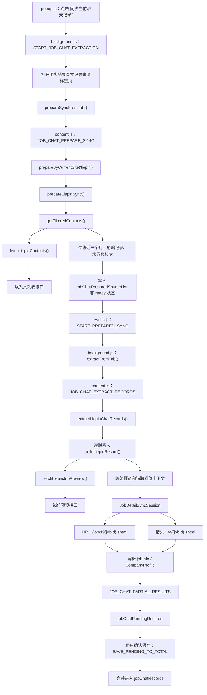

# 猎聘数据同步逻辑

本文记录 Chrome 插件在猎聘（`*.liepin.com`）页面同步沟通记录时的调用链、接口、筛选与去重规则、字段映射和阶段性存储逻辑，并说明聊天窗口职位图标的跳转地址来源。

## 岗位信息同步功能

猎聘同步不仅保存联系人和最后一条消息，还会同步当前会话关联的岗位信息：

- 通过 `job-preview` 获取岗位 ID、名称、地点、经验、学历、薪资和公司。
- 根据联系人 `homePage` 区分公司 HR 和猎头。
- 公司 HR 请求 `/job/19{jobId}.shtml`，猎头请求 `/a/{jobId}.shtml`。
- 解析岗位正文、关键词及具备稳定公司 ID 的公司资料。
- 同步页自动补齐缺失岗位，总览页支持对选中记录强制刷新。
- 同步页分别显示“沟通记录”和“岗位信息”进度。
- `flag=1,data={}` 表示联系人当前无关联岗位，标记成功并跳过详情请求。
- `.apply-stop-title` 表示职位已暂停招聘，保留已有岗位数据、追加停招说明并标记成功。
- 联系列表、岗位预览和详情页的请求及响应均实时发送到结果页的一次性请求日志。

详细调用链、数据映射、特殊页面处理、日志、测试和验收标准见
[猎聘岗位信息同步实施方案与当前状态](liepin-job-detail-plan.md)。

## 当前能力边界

当前猎聘适配器：

- 同步最近三个月的联系人及最后一条消息。
- 为每个待同步联系人获取当前会话的岗位预览。
- 支持新增记录、最后消息状态更新及缺失岗位详情补齐。
- 根据联系人主页区分公司 HR 和猎头，并请求对应的岗位详情 HTML。
- 同步通用 `jobRef`、`jobInfo` 和具有稳定公司 ID 的公司资料。
- 支持总览页对选中猎聘记录强制刷新岗位详情。
- 支持限速、暂停、恢复和阶段性保存。
- 不抓取完整聊天消息历史。
- 支持向已有联系人批量发送自定义文本消息。
- 支持从首页推荐岗位读取目标职位并通过 `chat.open-chat` 批量触发默认招呼语；首请求使用
  `operateKind=LOGIN`，接口返回 `hasNextPage=true` 时以 `operateKind=UP` 继续拉取推荐岗位，
  详情见[猎聘推荐岗位批量自动打招呼](liepin-auto-greeting-plan.md)。
- 联系人列表固定请求第 `0` 页、每页 `100` 条，目前不会继续翻页。

适配器注册信息：

```js
JobChatSiteAdapters.register('liepin', {
  siteKey: 'liepin',
  supportsJobDetail: true,
  requiresDetailAccessToken: false,
  prepareSync: prepareLiepinSync,
  extractRecords: extractLiepinChatRecords,
  refreshRecords: refreshLiepinRecords,
  resolveJobAccess: resolveLiepinJobAccess,
  fetchJobDetail: fetchLiepinJobDetail,
  normalizeJobResponse: normalizeLiepinJobResponse,
});
```

## 整体调用链



### 准备阶段

1. `popup.js` 检查当前活动标签页是否匹配 `liepin.com`。
2. 点击同步按钮后，发送：

   ```js
   {
     type: 'START_JOB_CHAT_EXTRACTION',
     tab: { id, url, title }
   }
   ```

3. `background.js` 保存 `jobChatLastSourceTab`，打开同步结果页，并调用 `prepareSyncFromTab()`。
4. 后台向猎聘标签页发送 `JOB_CHAT_PREPARE_SYNC`。若内容脚本尚未加载，则注入 `CONTENT_SCRIPT_FILES` 后重试一次。
5. `content.js` 根据当前域名取得 `liepin` adapter，调用 `prepareLiepinSync()`。
6. `prepareLiepinSync()` 读取联系人列表，与以下本地数据比对：
   - `jobChatRecords`：已经保存的总记录。
   - `jobChatPendingRecords`：本轮尚未确认保存的结果。
   - `jobChatIgnoredRecords`：用户忽略的记录。

7. 准备阶段只计算新增数和更新数，不请求每个联系人的岗位预览。
8. 联系人原始列表及摘要写入 `jobChatPreparedSourceList`，同步页进入 `ready` 状态。

### 实际同步阶段

1. 用户在同步结果页选择是否同步新增、更新记录，并发送：

   ```js
   {
     type: 'START_PREPARED_SYNC',
     syncSelection: {
       includeInsert,
       includeUpdate
     }
   }
   ```

2. `background.js` 从 `jobChatLastSourceTab` 找回猎聘标签页，调用 `extractFromTab()`。
3. 后台向内容脚本发送 `JOB_CHAT_EXTRACT_RECORDS`。
4. `content.js` 调用 `extractLiepinChatRecords(options)`。
5. 提取器优先读取准备阶段固化的 `jobChatPreparedSourceList`，暂停恢复时不重新扩展待处理范围；没有快照时才重新请求联系人列表。
6. 对每个待同步联系人依次执行 `buildLiepinRecord()`：
   - 解析联系人列表中的 `lastPayload`。
   - 请求当前会话岗位预览。
   - 持久化 `jobId`、`jobKind`、联系人类型和详情 URL。
   - 通过通用岗位同步核心请求、解析岗位详情。
   - 按字段优先级生成统一记录和公司资料。
   - 更新进度。
   - 将当前完整结果列表阶段性保存。

7. 全部完成后，后台再次规范化结果并写入 `jobChatPendingRecords`。
8. 用户确认保存后，`SAVE_PENDING_TO_TOTAL` 调用 `savePendingToTotal()`，按 `recordKey` 合并进入 `jobChatRecords`。

## 登录用户标识

所有猎聘接口都需要当前登录用户的 IM ID。`getLiepinImId()` 按以下顺序读取：

1. Cookie `imId_0`。
2. `localStorage`。
3. `sessionStorage`。

缓存回退逻辑会搜索：

```text
imId_0=<32 位十六进制字符串>
```

若没有找到 IM ID，同步立即失败，并提示用户确认已经登录猎聘并刷新页面。

## 公共请求逻辑

所有接口通过 `postLiepinApi(path, params)` 发起：

```js
fetch(`https://api-c.liepin.com/api/${path}`, {
  method: 'POST',
  credentials: 'include',
  mode: 'cors',
  headers: liepinHeaders(),
  body: new URLSearchParams(params).toString(),
});
```

关键请求头：

| 请求头              | 值或来源                                          |
| ------------------- | ------------------------------------------------- |
| `Accept`            | `application/json, text/plain, */*`               |
| `Content-Type`      | `application/x-www-form-urlencoded`               |
| `X-Client-Type`     | `web`                                             |
| `X-Requested-With`  | `XMLHttpRequest`                                  |
| `X-Fscp-Bi-Stat`    | 当前页面地址 `{ location: location.href }`        |
| `X-Fscp-Fe-Version` | `1.0.0`                                           |
| `X-Fscp-Std-Info`   | `{"client_id":"11156"}`                           |
| `X-Fscp-Trace-Id`   | `crypto.randomUUID()`；不支持时使用时间戳加随机值 |
| `X-Fscp-Version`    | `1.1`                                             |

响应必须同时满足：

- HTTP 状态成功。
- JSON `flag === 1`。

调用方最终拿到 `data.data || {}`。接口错误会包含 HTTP 状态或截断后的响应内容。

## 接口一：联系人列表

```http
POST https://api-c.liepin.com/api/com.liepin.im.c.contact.get-contact-list
Content-Type: application/x-www-form-urlencoded

imUserType=0
imId=<当前登录用户 IM ID>
imApp=1
pageSize=100
curPage=0
```

调用函数：

```text
fetchLiepinContacts(imId)
  → postLiepinApi('com.liepin.im.c.contact.get-contact-list', params)
  → data.list
  → filterLiepinRecentContacts()
```

仅使用 `data.list` 数组。列表返回后按照 `latestMsgTime` 过滤，只保留最近三个月的联系人。

当前没有基于总数继续请求 `curPage=1, 2...`，因此联系人超过 100 条时可能无法覆盖完整列表。

## 接口二：会话岗位预览

```http
POST https://api-c.liepin.com/api/com.liepin.im.c.chat.job-preview
Content-Type: application/x-www-form-urlencoded

imUserType=0
imId=<当前登录用户 IM ID>
imApp=1
oppositeImId=<聊天对端 IM ID>
```

调用函数：

```text
buildLiepinRecord()
  → fetchLiepinJobPreview(imId, oppositeImId)
  → postLiepinApi('com.liepin.im.c.chat.job-preview', params)
```

岗位预览失败不会中断整次同步。当前记录会回退到联系人列表和 `lastPayload` 中已有的数据。

插件消费岗位预览中的以下字段：

| 岗位预览字段  | 用途                                    |
| ------------- | --------------------------------------- |
| `jobId`       | `jobRef.externalId` 和详情 URL          |
| `jobKind`     | HR/猎头类型交叉校验                     |
| `jobTitle`    | `jobInfo.title` 回退和统一记录岗位名称  |
| `jobDqName`   | `jobInfo.location` 回退                 |
| `reqWorkYear` | `jobInfo.experience` 回退               |
| `reqEdu`      | `jobInfo.education` 回退                |
| `jobSalary`   | `jobInfo.salary` 回退和统一记录岗位名称 |
| `compStage`   | 猎聘预览上下文                          |
| `jobCompany`  | 统一记录和公司名称回退                  |

返回有效 `jobId` 时，预览信息先形成未完成岗位数据，详情 HTML 成功解析后才会
把 `jobInfo.fetchStatus` 标记为 `success`。

若接口返回 `flag=1,data={}`，表示当前联系人没有关联岗位，并非请求失败。记录
会写入 `jobPreviewStatus="empty"` 和 `jobInfo.fetchStatus="success"`，跳过
详情请求，且不会在后续普通同步中反复入队。

## 岗位详情页

联系人类型由 `homePage` 的 pathname 判断：

```text
/company/{id}/ → 公司 HR
/hunter/{id}   → 猎头
其他           → 无法分类，本条详情同步失败
```

详情地址：

```text
公司 HR：https://www.liepin.com/job/19{jobId}.shtml
猎头：   https://www.liepin.com/a/{jobId}.shtml
```

`jobRef.externalId` 始终保存原始 `jobId`，HR URL 中的 `19` 不进入岗位 ID。
联系人主页是主分类依据，`jobKind=2`（HR）和 `jobKind=1`（猎头）只用于冲突告警。

详情页以当前猎聘登录态 GET 请求，固定按 2 秒间隔顺序执行。猎聘不使用 BOSS 的
详情访问凭证，也不采用 BOSS“每 4 个请求刷新标签页”的策略。

HTML 解析范围：

| 数据             | 选择器/来源                                                      |
| ---------------- | ---------------------------------------------------------------- |
| 标题             | `.job-apply-container .name-box > .name`                         |
| 薪资             | `.job-apply-container .salary`                                   |
| 地点、经验、学历 | `.job-apply-container .job-properties`                           |
| 职位正文         | `.job-intro-container [data-selector="job-intro-content"]`       |
| 技能             | `.job-intro-container .labels`                                   |
| 公司信息         | `.company-info-container`                                        |
| 公司简介         | `.company-intro-container` 与 `.company-info-container` 合并去重 |

解析器限制在主岗位和主公司区块内，不读取页面下方的推荐岗位卡片。

推荐岗位自动打招呼使用详情页筛选时，技术关键字、职位关键字和岗位关键字过滤器统一只
检索 `.job-intro-container [data-selector="job-intro-content"]` 的职位正文。岗位标题、
`.labels` 技能标签、“其他信息”和公司简介都不参与这三项自动消息关键词判断。

如果页面存在 `.apply-stop-title`，表示当前职位已暂停招聘。解析器保留岗位预览
及已有岗位内容，在 `jobInfo.description` 末尾追加“该职位已暂停招聘”，并标记
同步成功。未命中停招标识时，详情页缺少 `.job-apply-container` 或
`.job-intro-container` 才视为解析失败。

## `lastPayload` 解析

`parseLiepinLastPayload(lastPayload)` 支持字符串 JSON 和已经解析的对象。

消息正文：

```js
(payload.bodies || [])
  .map((body) => body?.msg)
  .filter(Boolean)
  .join(' ');
```

岗位降级信息来自：

```js
payload.ext.extBody.bizData;
```

读取字段：

- `jobTitle`
- `jobSalary`
- `jobCompany`

若 JSON 解析失败：

- `message` 使用 `String(lastPayload)` 规范化后的结果。
- 岗位名称、薪资和公司降级为空字符串。

## 数据筛选与增量判断

### 时间范围

`filterLiepinRecentContacts()` 只保留：

```text
latestMsgTime >= 当前日期往前推三个月的当天 00:00:00
```

无时间、时间无效或早于范围的联系人都会被排除。

### 匹配键

联系人主键优先级：

```text
oppositeImId
→ id
→ oppositeUserId
→ latestMsgId
```

匹配时会同时添加原始键和带站点前缀的键：

```text
<raw-key>
liepin|<raw-key>
```

已有记录会索引：

- `liepin.oppositeImId`
- `liepin.contactKey`
- `recordKey`
- `liepin.latestMsgId`

联系人项会索引：

- `oppositeImId`
- `liepinContactKey(item)`
- `id`
- `oppositeUserId`
- `latestMsgId`

最终持久化的稳定 `recordKey` 优先为：

```text
liepin|{liepin.oppositeImId.toLowerCase()}
```

只有缺少 `oppositeImId` 时才会降级到现有 `recordKey` 或展示字段组合。

### 新增与更新

不存在匹配记录时：

- `includeInsert !== false` 才进入同步队列。

存在匹配记录时：

- `includeUpdate !== false`。
- 且 `latestMsgId` 变化、消息状态变化，或通用岗位信息不完整。

因此消息没有变化但 `isCompleteJobInfo(record)` 为假时，也会进入详情补齐队列。
公司、岗位名称等展示字段单独变化不会触发更新。

### 消息状态

映射规则：

```js
messageStatus = normalizeText(item.oppositeRead) === '1' ? '1' : '0';
```

判断旧记录状态时优先使用：

```text
record.messageStatus
→ record.liepin.oppositeRead
→ 空字符串
```

## 完整会话同步

联系人被现有增量逻辑选中后，通过以下接口补齐完整会话：

```text
POST https://api-c.liepin.com/api/com.liepin.im.c.chat.chat-list
```

首页使用当前账号 `imId`、联系人 `oppositeImId`、空 `maxMessageId` 和
`pageSize=20`。后续页使用上一页全部原始消息中最旧的 `msgId` 作为
`maxMessageId`。响应中的 `data.pageSize` 不作为完成依据；同步通过
`totalCount`、短页、空页、重复游标和最大页数保护共同判断是否完成。

消息正文位于字符串化的 `payload.bodies[].msg`。`msgId` 全程以字符串处理；
`direction=0` 映射为当前用户发送，`direction=1` 映射为对端发送。最终写入 BOSS
与猎聘共用的顶层 `conversation`，按时间升序展示。

只有完整分页成功后才替换旧会话。任一页失败时保留旧记录和旧 `latestMsgId`，确保
下次仍能按原增量逻辑重试。总览页手动同步会重新读取联系人列表；岗位信息已经完整
时只检查会话，不请求岗位预览和岗位详情。

完整设计与边界见
[猎聘完整会话同步方案](liepin-conversation-history-sync-plan.md)。

## 统一记录数据映射

`buildLiepinRecord(item, imId, index, existingRecord)` 生成的主要字段如下。

| 统一字段         | 来源与优先级                                                             |
| ---------------- | ------------------------------------------------------------------------ | ------------ |
| `index`          | 已有位置 `existingIndex + 1`，否则 `records.length + 1`                  |
| `time`           | `formatDateTime(new Date(Number(item.latestMsgTime)))`                   |
| `updatedAt`      | 当前 ISO 时间                                                            |
| `recruiterName`  | `item.name`                                                              |
| `recruiterTitle` | `item.title`                                                             |
| `companyName`    | `preview.jobCompany` → `item.company` → `lastPayload.bizData.jobCompany` |
| `jobName`        | `preview.jobTitle` → `lastPayload.bizData.jobTitle`，再附加对应薪资      |
| `lastMessage`    | `lastPayload.bodies[].msg` → 原始 `item.lastPayload`                     |
| `messageStatus`  | `item.oppositeRead === '1' ? '1' : '0'`                                  |
| `jobRef`         | 原始 `preview.jobId`，`detailAccessToken` 为空                           |
| `jobInfo`        | 详情页优先，岗位预览字段作为回退                                         |
| `companyKey`     | 详情页存在稳定公司 ID 时为 `liepin                                       | {companyId}` |

岗位名称和薪资同时存在时：

```text
{jobTitle}（{jobSalary}）
```

只有岗位名称时仅保存岗位名称；只有薪资而没有岗位名称时，`jobName` 为空。

后台 `prepareRecord()` 还会补充：

| 字段              | 值                               |
| ----------------- | -------------------------------- |
| `siteKey`         | `liepin`                         |
| `sourceName`      | `猎聘`                           |
| `applicationDate` | 现有申请时间，缺失时使用记录时间 |
| `updatedDate`     | 规范化后的记录时间               |
| `recordKey`       | `makeRecordKey(record)` 计算结果 |
| `note`            | 保留已有备注，否则为空           |

## 猎聘内部字段映射

记录的 `liepin` 对象用于增量同步和稳定匹配：

```json
{
  "imId": "",
  "oppositeImId": "",
  "oppositeUserId": "",
  "latestMsgId": "",
  "latestMsgTime": "",
  "oppositeRead": "",
  "contactKey": "",
  "homePage": "",
  "jobId": "",
  "jobKind": "",
  "contactType": "hr | hunter | unknown",
  "jobDetailUrl": "",
  "jobPreviewStatus": "available | empty | failed",
  "jobPreviewError": "",
  "jobPreview": {}
}
```

| 内部字段                  | 来源                                       |
| ------------------------- | ------------------------------------------ |
| `liepin.imId`             | `item.imId` → 当前登录 `imId`              |
| `liepin.oppositeImId`     | `item.oppositeImId` → 已有记录值           |
| `liepin.oppositeUserId`   | `item.oppositeUserId` → 已有记录值         |
| `liepin.latestMsgId`      | `item.latestMsgId`                         |
| `liepin.latestMsgTime`    | `item.latestMsgTime`                       |
| `liepin.oppositeRead`     | `item.oppositeRead`                        |
| `liepin.contactKey`       | `liepinContactKey(item)`                   |
| `liepin.homePage`         | `item.homePage` → 已有记录值               |
| `liepin.jobId`            | `preview.jobId` → 已有岗位 ID              |
| `liepin.jobKind`          | `preview.jobKind`                          |
| `liepin.contactType`      | 根据 `homePage` 分类                       |
| `liepin.jobDetailUrl`     | 根据联系人类型和 `jobId` 构造              |
| `liepin.jobPreviewStatus` | 岗位预览状态：有岗位、无关联岗位或请求失败 |
| `liepin.jobPreviewError`  | 岗位预览失败原因；成功时为空               |
| `liepin.jobPreview`       | 规范化后的岗位预览字段                     |

构建更新记录时会先展开 `existingRecord` 和 `existingRecord.liepin`，因此原记录中未被本轮覆盖的字段会保留。

普通同步不会仅因旧记录缺少 `oppositeUserId` 就把它计入待更新列表；记录因消息或
岗位本来需要更新时会顺带保存该字段。手动同步岗位时会从联系人列表补全，发送时还会
通过聊天列表兜底。批量发送的接口、缓存和失败处理见
[猎聘批量发送文本消息](liepin_send_msg.md)。

## 阶段性保存、限速与取消

### 限速

同步间隔来自：

```text
jobChatSyncRateSettings
→ jobChatSyncRateLimit（兼容旧字段）
→ 默认 500 ms
```

`jobChatSyncRateSettings` 支持 `second`、`minute`、`hour`，`count` 限制在 `1..3600`。实际间隔为：

```text
ceil(单位毫秒数 / count)
```

联系人/预览处理沿用用户设置的同步速率；岗位详情通过
`JobDetailSyncSession` 固定至少间隔 2 秒。猎聘不设置每页 4 个详情请求的上限。

### 阶段性保存

实际同步开始前和每处理一条联系人后，都会调用：

```text
saveLiepinPartial()
→ savePartial()
→ JOB_CHAT_PARTIAL_RESULTS
→ background-database.js/savePartialExtraction()
→ chrome.storage.local.jobChatPendingRecords
```

阶段性结果保存的是当前完整 `records` 数组，不只是本次新增的一条。

### 取消和恢复

循环每处理一条联系人前检查：

```text
jobChatCancelRequested
jobChatLiepinCancelRequested
```

任一为 `true` 即保存：

```js
{
  interrupted: true,
  completed: false
}
```

恢复时后台清除两个标志，并重新调用 `extractFromTab()`。增量筛选会跳过已经完成且没有变化的记录。

## 错误与回退

| 场景                              | 行为                                              |
| --------------------------------- | ------------------------------------------------- |
| 找不到 `imId_0`                   | 整次准备或同步失败                                |
| 联系人列表 HTTP 失败              | 整次准备或同步失败                                |
| 联系人列表 `flag !== 1`           | 整次准备或同步失败                                |
| 岗位预览 HTTP/业务失败            | 本条岗位失败，保留联系人和 `lastPayload` 降级字段 |
| `flag=1,data={}`                  | 当前无关联岗位，标记成功并跳过详情请求            |
| 非空岗位响应的 `jobId` 缺失或非法 | 本条岗位详情失败，保留预览和沟通数据              |
| `homePage` 无法分类               | 本条岗位详情失败，不猜测 HR/猎头 URL              |
| 详情页 403/429                    | 本条失败并标记为猎聘安全验证/限流                 |
| 详情页要求登录或验证              | 本条失败，提示登录或安全验证                      |
| 存在 `.apply-stop-title`          | 追加“该职位已暂停招聘”，标记成功                  |
| 未知页面主岗位容器缺失            | 本条解析失败，不读取推荐岗位                      |
| 公司 ID 缺失                      | 岗位仍可成功，不保存独立公司资料                  |
| `lastPayload` JSON 无法解析       | 原始文本作为最后消息，岗位降级字段为空            |
| 缺少 `oppositeImId`               | 不请求岗位预览，记录匹配键按其他字段降级          |
| 用户取消                          | 保存已完成部分并返回 `interrupted: true`          |

## 同步摘要

猎聘同步摘要：

```json
{
  "inserted": 0,
  "updated": 0,
  "updatedMsg": 0,
  "jobDetailSync": 0,
  "jobDetail": {
    "requested": 0,
    "success": 0,
    "failed": 0,
    "skipped": 0
  },
  "conversation": {
    "requested": 0,
    "success": 0,
    "failed": 0,
    "skipped": 0,
    "messageFailed": 0
  }
}
```

其中 `updated` 与 `updatedMsg` 含义相同，均表示因最后消息 ID 或消息状态变化而重新同步的记录数。`jobDetailSync` 是准备阶段预计补齐的岗位数，`jobDetail` 是实际执行统计；`conversation` 记录完整会话请求、成功、失败、跳过及因会话失败而未更新最近消息的数量。

## 相关源码

- 同步按钮入口：`popup.js`
- 后台准备、执行、暂停和恢复调度：`background.js`
- 内容脚本消息路由：`content.js`
- 站点适配器注册：`site-adapters.js`
- 猎聘联系人、岗位预览、映射与增量同步：`liepin-extractor.js`
- 最近三个月过滤、限速、进度和部分结果：`content-common.js`
- 待保存结果规范化与总记录合并：`background-database.js`
- `recordKey` 和统一记录规范化：`shared-records.js`
- 完整数据模型：`docs/dataModel.md`
- 岗位信息同步专题：[liepin-job-detail-plan.md](liepin-job-detail-plan.md)
- 完整会话同步专题：[liepin-conversation-history-sync-plan.md](liepin-conversation-history-sync-plan.md)
